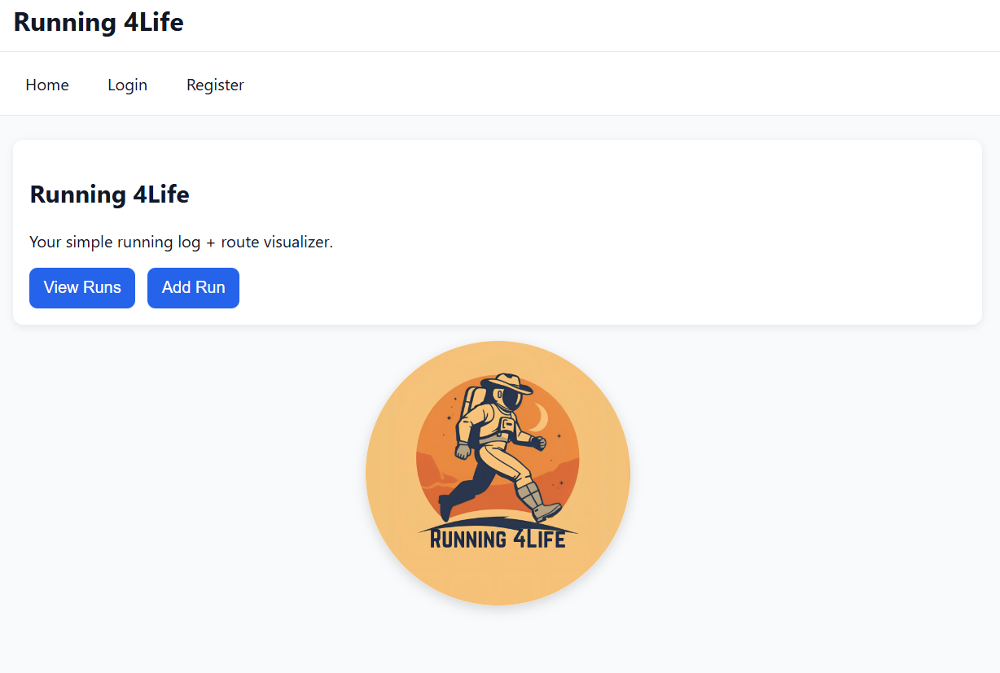
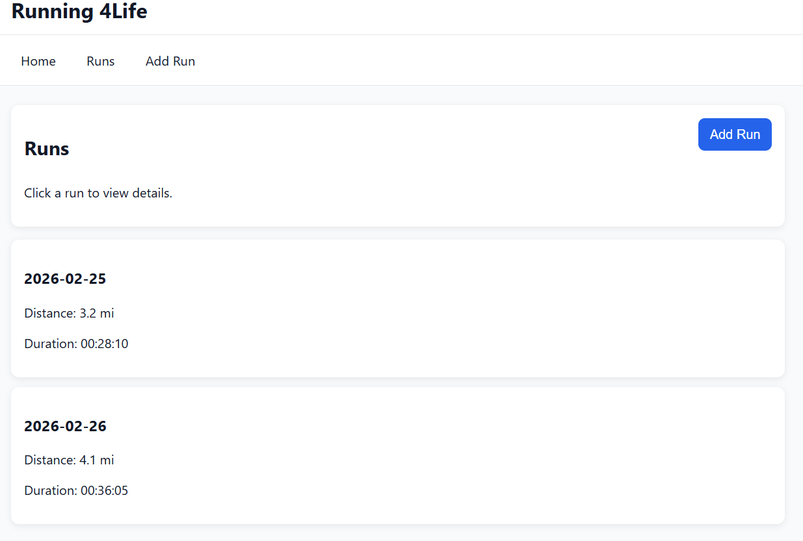
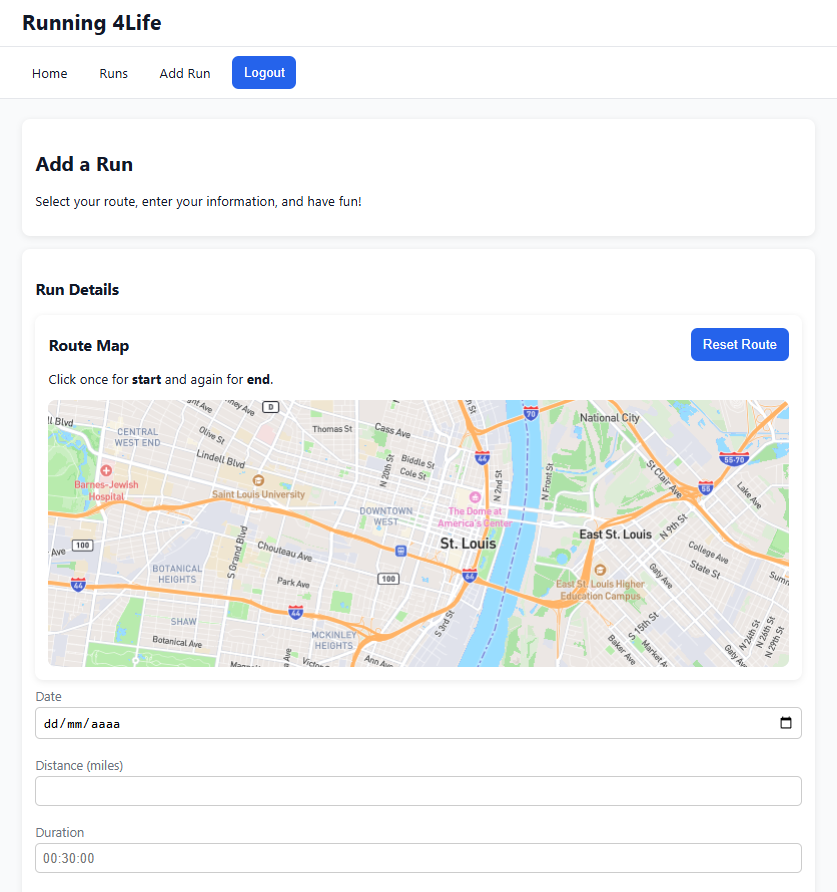

# Running 4Life — Running Companion SPA
## Project Overview

Running 4Life is a React single-page application designed for recreational runners who want a simple way to track workouts and visualize running routes. Many runners rely on multiple tools to log workouts, analyze performance, and view routes. Running 4Life consolidates these tasks into one lightweight dashboard where users can record runs, view detailed workout information, and interact with a map-based route visualization.

The application focuses on simplicity, accessibility, and responsiveness, making it useful for both desktop and mobile users.

The project demonstrates modern frontend development practices including authentication state management, secure routing, API integration, and comprehensive unit testing.

## Problem Statement
Recreational runners often track workouts using multiple disconnected tools such as spreadsheets, notes apps, or mapping software. These approaches can make it difficult to maintain a consistent running log or visualize routes clearly.

Running 4Life addresses this problem by providing a centralized interface where runners can:

* record workout details

* visualize routes on an interactive map

* access summary statistics

* manage workouts through a simple dashboard

## Features
* Log running workouts (date, distance, duration, notes)
* Interactive route visualization using Mapbox
* View individual run details
* Dynamic navigation using React Router
* Global state management using React Context
* Mobile-first responsive layout
* Unit testing with Vitest and React Testing Library

## Interactive Mapping

* Interactive map powered by Mapbox GL JS
* Route visualization using the Mapbox Directions API
* Map preview available when creating a run

## Authentication System

* User registration and login
* JWT-style token simulation stored in session storage
* Protected routes that require authentication
* Logout functionality with session cleanup

## Statistics

* Total runs recorded
* Total distance logged
* Average pace calculation
* Weekly summary visible only when authenticated

## Security Enhancements

* XSS mitigation through input validation and sanitization
* Basic CSRF protection pattern in forms
* Secure session-based authentication storage
* Protected route enforcement

## Testing

* Comprehensive unit tests using:
  * Vitest
  * React Testing Library
* Coverage includes:
  * authentication flows
  * protected routes
  * form validation
  * run creation
  * context state management
  * navigation behavior

## UI / UX

* Mobile-first responsive layout
* Simple navigation structure
* Interactive user feedback through alerts and validation

## Available Routes
Route	Description

* /	Home page displaying application overview and summary
* /runs	Displays list of saved runs
* /runs/new	Form to create a new run and view route map
* /runs/:id	Displays detailed information for a specific run
* 404 page for invalid routes

## Technologies Used
* React (Vite)
* React Router
* React Context API
* Mapbox GL JS
* Mapbox Directions API
* Vitest
* React Testing Library
* CSS (mobile-first responsive design)
* Vercel (deployment)

## Project Structure

src
 ├── components
 │   ├── auth
 │   ├── layout
 │   ├── runs
 │   └── ui
 ├── contexts
 │   ├── AuthContext
 │   └── RunsContext
 ├── pages
 │   ├── HomePage
 │   ├── RunsPage
 │   ├── RunDetailsPage
 │   ├── LoginPage
 │   └── RegisterPage
 ├── tests
 │   ├── authentication tests
 │   ├── run management tests
 │   └── navigation tests
 └── assets

## Setup & Installation
Clone the repository

* git clone <your-repo-url>
* cd running-4life

Install dependencies
* npm install

Create environment variable file:
* Create .env.local in the project root: VITE_MAPBOX_TOKEN=your_mapbox_token_here

Run development server
* npm run dev

Running Tests
* npm test

## API Documentation & Dependencies
Mapbox GL JS
Used to render the interactive map inside the application.

Mapbox Directions API
The Directions API retrieves a route between selected coordinates and returns:
route geometry (coordinates)
distance
estimated duration

The response is parsed and displayed as a route line on the map.
Documentation: https://docs.mapbox.com/api/navigation/directions/

### Deployment
The application is deployed using Vercel.
Live URL:
https://running-4life-qp8va61e6-evrots-projects.vercel.app

Deployment Instructions:

Push project to GitHub
Import repository into Vercel

Add environment variable:
VITE_MAPBOX_TOKEN=your_mapbox_token_here
Redeploy the project

## Screenshots

Home Page

Runs Page

New Run Page

## Known Issues
* Runs are stored only in client memory and are not persisted after page refresh

## Future Enhancements (Final Submission Plan)

* Persistent database storage (Node.js backend + database)
* Advanced run analytics and progress charts
